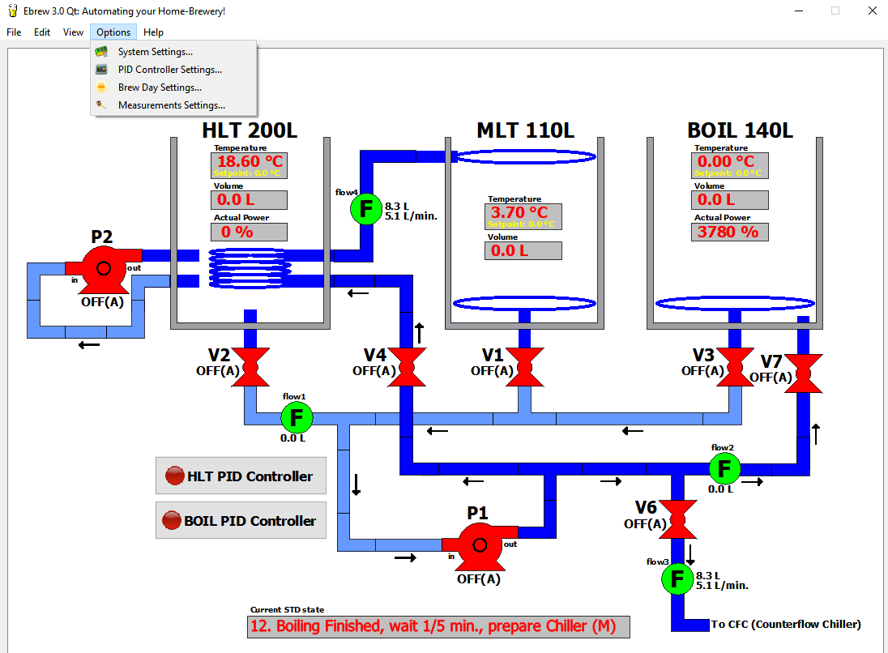

# Home-Brewery Automation: PC Front-End
PC-application for my home-brewery: Ebrew 3.0 Qt.

 
*Screen-dump of Program*

# Features
- Connects to the Brew-Arduino over USB or Ethernet
- State Transition Diagram (STD) that fully automates the entire Brewing-Day. Only adding Malt is still a manual operation
- Cleaning-In-Place (CIP) also done automatically
- Many brewing parameters are adjustable and stored in Windows Registry: PID-control, Mashing, Sparging, Boiling and Measurements
- Brewing variables (volume, temperature) are set automatically, but can be overruled manually with so-called Switches and Fixes
- Reading of entire mash-scheme: one file stores all relevant parameters
- Convenient Graphical User Interface (GUI) that shows exactly what is going on in the brewing setup

More software design details: see my website: http://www.vandelogt.nl/uk_software.php

# Software Development Environment
Qt 5. This version replaces the Ebrew 2.0 version created with Borland C++ Builder 6.

This release is still under heavy development. It is shown here just to have version control active on this project. It is not intended to be actually used in a brewing session!

# Interface with Brew-Arduino
The Arduino-Nano uses a virtual COM port or an Ethernet connection as its main-connection to the PC. This virtual COM port used the USB port of the Arduino-Nano. At the PC side, the Arduino Nano is recognised by Windows
(if the standard drivers for the Arduino-Nano have been installed). Virtual COM port settings are (38400,N,8,1). However, the  Ethernet connection is preferred over USB.

Typically the PC-program sends commands to the Arduino-Nano, like **P0** (Pump Off) or **P1** (Pump On). These commands are then executed by the Arduino-Nano.
Although you can type in the commands manually, it is more efficient to use a dedicated PC-program for it, with a Graphical User Interface.

More information about the PC-Interface can be found at my website: http://www.vandelogt.nl/uk_hardware.php#PC_INTF

